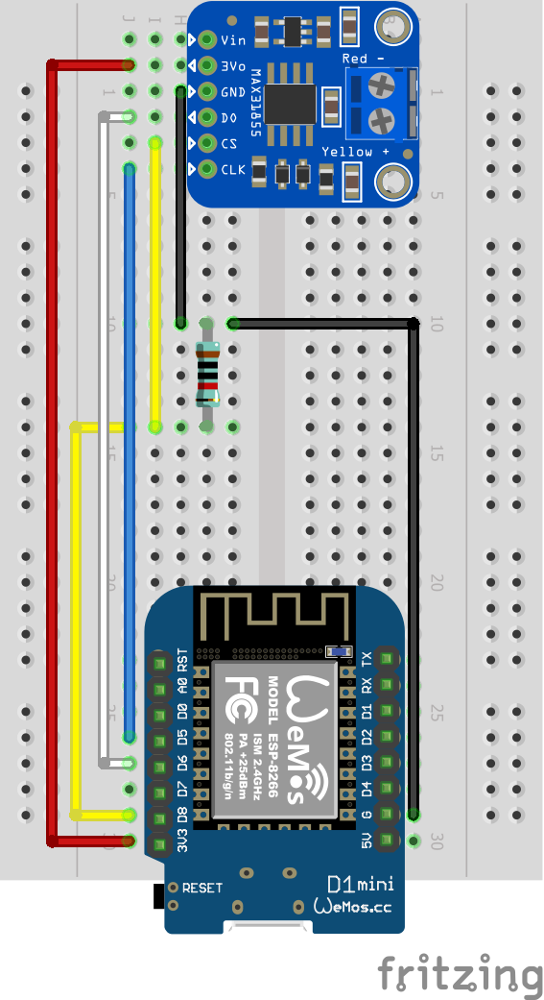

# IOT water temperature sensor

This is a relatively simple IOT sensor I put together to monitor the temperature of the water
coming from my outdoor wood boiler. The temperature probe monitors the temperature every 60
seconds and sends it to my Home Assistant server via ESPHome (or MQTT). 

## Home Assistant

Home Assistant has actions that notify me when the water exceeds 185 degrees and is at risk
of boiling over. This typically means I have left a door open and the fire is raging! I have
a second action when the water temperature goes under 145 which typically means I need to load
more firewood.

## Wiring Diagram

The wiring diagram is pretty simple. I found I had to use a 10k Ohm pull down resistor on the
Chip Select (CS) line or it wouldn't boot or flash reliably:

## 3D Printed Project Box

I also included the OpenSCAD file I used to 3D print a case to hold it all:

## Parts List

Here are the parts I used to build the solution:

[WeMos D1 Mini clone](https://smile.amazon.com/gp/product/B08C7FYM5T/ref=ppx_yo_dt_b_search_asin_title?ie=UTF8&psc=1)

[Adafruit MAX31855 breakout board](https://smile.amazon.com/gp/product/B00SK8NDAI/ref=ppx_yo_dt_b_search_asin_title?ie=UTF8&psc=1)

[ElectroCookie Solderable Breadboard](https://smile.amazon.com/gp/product/B07ZV8FWM4/ref=ppx_yo_dt_b_asin_title_o02_s01?ie=UTF8&psc=1)

[K-Type Pipe Thread Temperature Sensor Probe](https://smile.amazon.com/gp/product/B07QP6P3NL/ref=ppx_yo_dt_b_asin_title_o09_s00?ie=UTF8&psc=1)

[Stainless Steel Reducer](https://smile.amazon.com/gp/product/B07NZ9XQ19/ref=ppx_yo_dt_b_asin_title_o05_s00?ie=UTF8&psc=1)